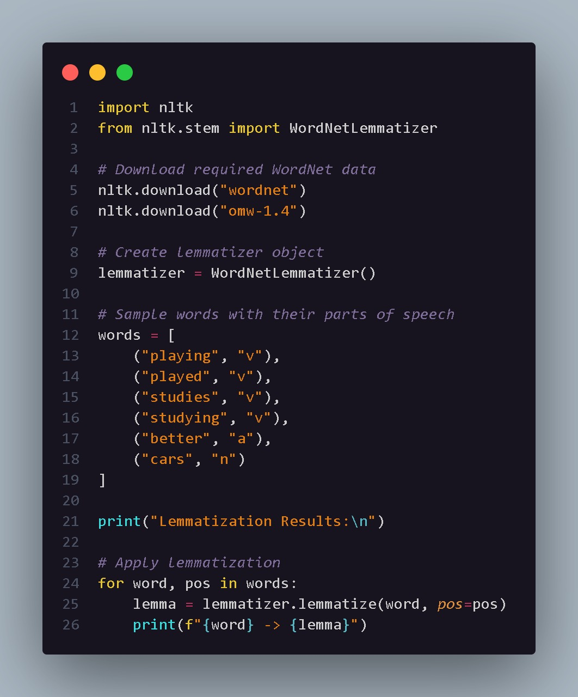

# Lemmatization

## Aim

To understand and implement lemmatization using the WordNet Lemmatizer provided by the Natural Language Toolkit (NLTK).

## Introduction

Lemmatization is a Natural Language Processing technique used to convert words into their meaningful base or dictionary form, known as a lemma.

Unlike stemming, lemmatization considers the meaning and part of speech of a word to generate a more linguistically correct result.

Examples:

- playing → play
- studies → study
- cars → car
- better → good

Lemmatization generally produces more meaningful results compared to stemming.

## Code Explanation

The program imports the `WordNetLemmatizer` class from the `nltk.stem` module.

The following steps are performed:

1. The required WordNet resources are downloaded.
2. A `WordNetLemmatizer` object is created.
3. A list of words and their corresponding parts of speech is defined.
4. The `lemmatize()` method is applied to each word.
5. The original word and its resulting lemma are displayed.

The program uses the following part-of-speech tags:

- `v` – Verb
- `n` – Noun
- `a` – Adjective

Providing the correct part of speech helps the lemmatizer generate more accurate results.

## Python Code

The complete implementation is available in:

`lemmatization.py`

## Code Snapshot

## Output

## Conclusion

Lemmatization converts words into meaningful dictionary forms. Compared to stemming, it generally produces more accurate and linguistically correct results. It is widely used in NLP applications such as text classification, search engines, sentiment analysis, and information retrieval.