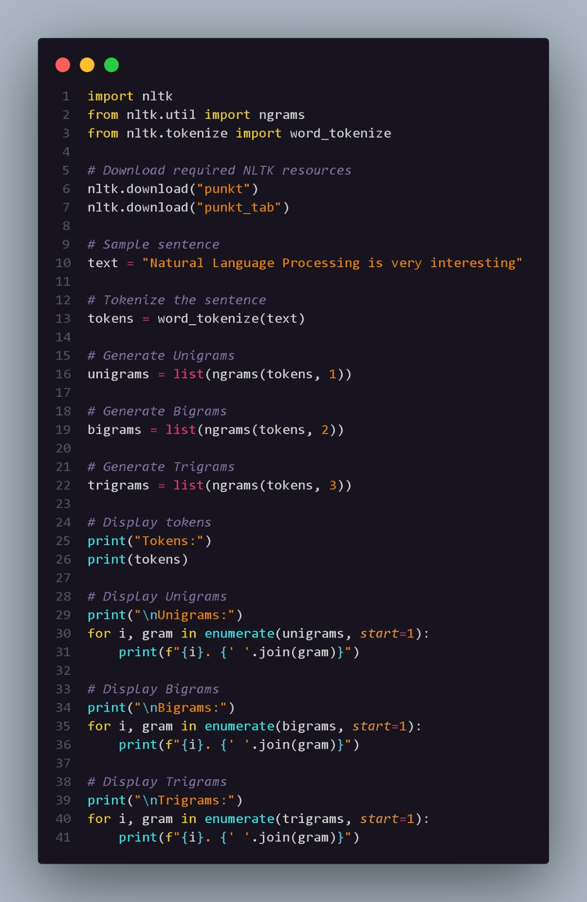
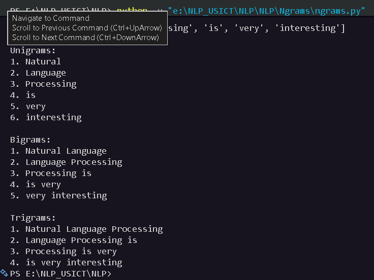

# N-Grams

## Aim

To understand and implement Unigram, Bigram, and Trigram models using Python and the Natural Language Toolkit (NLTK).

## Introduction

An N-gram is a contiguous sequence of `N` words or tokens in a text.

N-grams are commonly used in Natural Language Processing for understanding relationships between words and for applications such as language modeling, text prediction, speech recognition, and text analysis.

The three types demonstrated in this program are:

- **Unigram (N = 1):** Contains one word at a time.
- **Bigram (N = 2):** Contains two consecutive words.
- **Trigram (N = 3):** Contains three consecutive words.

For example, for the sentence:

`Natural Language Processing is very interesting`

The Unigrams are individual words, Bigrams contain two consecutive words, and Trigrams contain three consecutive words.

## Code Explanation

The program uses the `ngrams()` function from `nltk.util` and `word_tokenize()` from `nltk.tokenize`.

The following steps are performed:

1. Required NLTK resources are downloaded.
2. A sample sentence is defined.
3. The sentence is tokenized into individual words.
4. `ngrams(tokens, 1)` generates Unigrams.
5. `ngrams(tokens, 2)` generates Bigrams.
6. `ngrams(tokens, 3)` generates Trigrams.
7. The generated N-grams are displayed in the terminal.

## Python Code

The complete implementation is available in:

`ngrams.py`

## Code Snapshot

## Output

## Types of N-Grams

| N-Gram | N | Example |
|---|---:|---|
| Unigram | 1 | Natural |
| Bigram | 2 | Natural Language |
| Trigram | 3 | Natural Language Processing |

## Conclusion

N-grams provide a simple way to represent relationships between consecutive words in text. Unigrams consider individual words, Bigrams consider pairs of words, and Trigrams consider groups of three words. They are fundamental concepts used in various NLP applications.