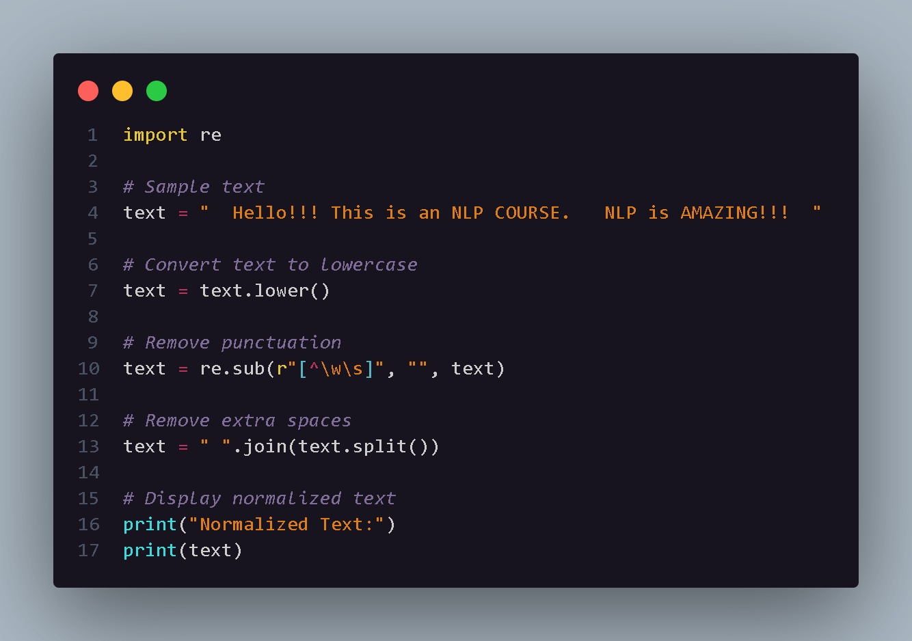

# Text Normalization

## Aim

To understand and implement text normalization using Python and the Natural Language Toolkit (NLTK).

## Introduction

Text normalization is an important preprocessing step in Natural Language Processing. Raw text may contain uppercase letters, punctuation marks, stopwords, and other unnecessary elements.

Normalization converts text into a cleaner and more consistent form. This helps improve the quality of textual data before applying NLP techniques or machine learning algorithms.

## Code Explanation

The program uses NLTK along with Python's `string` module.

The following preprocessing steps are performed:

1. The required NLTK resources are downloaded.
2. A sample text is stored in the `text` variable.
3. The text is converted to lowercase using the `lower()` method.
4. The text is divided into tokens using NLTK's `word_tokenize()` function.
5. Punctuation marks are removed using `string.punctuation`.
6. English stopwords are obtained using `stopwords.words("english")`.
7. Stopwords are removed from the tokenized text.
8. The final normalized tokens are displayed.

For example, common words such as `is`, `an`, and `this` may be removed because they generally provide less meaningful information for certain NLP tasks.

## Python Code

The complete implementation is available in:

`normalization.py`

## Code Snapshot

## Output

## Conclusion

Text normalization converts raw text into a cleaner and standardized form. In this implementation, lowercasing, tokenization, punctuation removal, and stopword removal are used to prepare the text for further NLP processing.