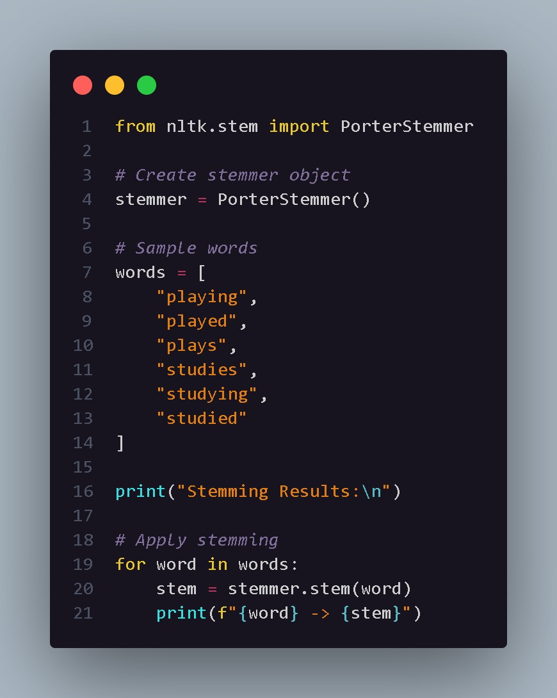
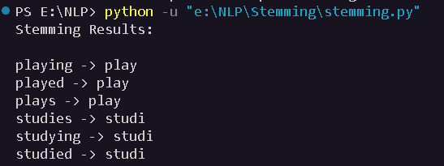

# Stemming

## Aim

To understand and implement stemming using the Porter Stemmer provided by the Natural Language Toolkit (NLTK).

## Introduction

Stemming is a text preprocessing technique used in Natural Language Processing to reduce different forms of a word to a common root form called a stem.

For example:

- playing
- played
- plays

can be reduced to:

`play`

Stemming helps reduce the number of unique words in a dataset and can improve the efficiency of NLP systems.

## Code Explanation

The program imports the `PorterStemmer` class from the `nltk.stem` module.

The following steps are performed:

1. A `PorterStemmer` object is created.
2. A list containing different forms of words is created.
3. Each word is processed using the `stem()` method.
4. The original word and its corresponding stem are displayed.

The Porter Stemmer uses rule-based techniques to remove prefixes or suffixes from words.

It is important to note that stemming does not always produce a grammatically correct English word. For example:

`studies → studi`

This occurs because stemming focuses on reducing words to a common root rather than producing a valid dictionary word.

## Python Code

The complete implementation is available in:

`stemming.py`

## Code Snapshot

## Output

## Conclusion

Stemming reduces different forms of words to a common root or stem. It is useful for reducing vocabulary size and improving the efficiency of NLP applications. However, the generated stem may not always be a meaningful dictionary word.