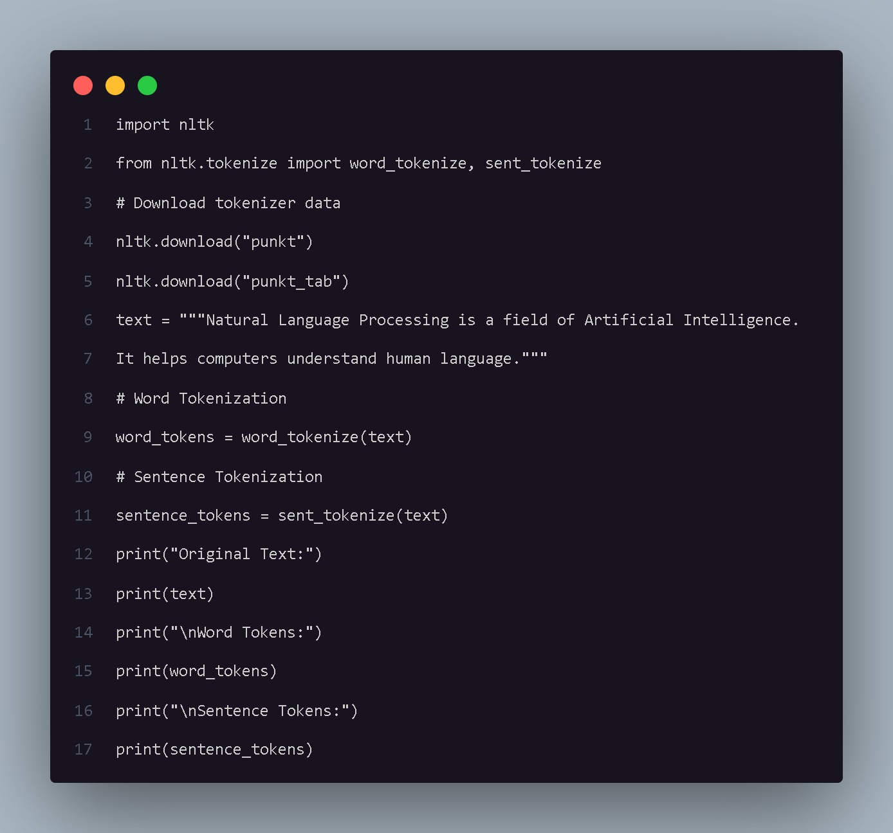
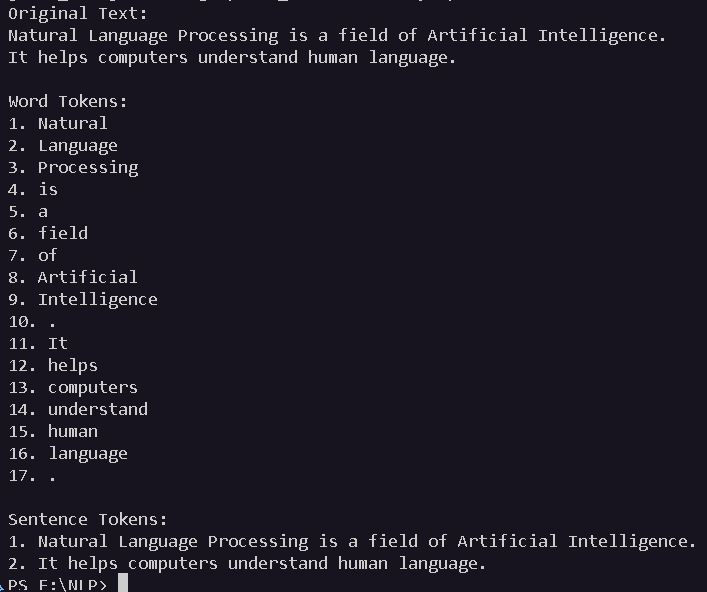

# Tokenization

## Aim

To understand and implement word tokenization and sentence tokenization using the Natural Language Toolkit (NLTK) library in Python.

## Introduction

Tokenization is one of the fundamental preprocessing steps in Natural Language Processing (NLP). It is the process of breaking a piece of text into smaller units called tokens.

Tokens can represent words, sentences, or other meaningful units of text. Tokenization helps convert unstructured text into a structured format that can be processed further by NLP techniques.

## Code Explanation

The program uses the following functions from the NLTK library:

- `word_tokenize()` – divides the input text into individual words and punctuation tokens.
- `sent_tokenize()` – divides the input text into individual sentences.

First, the required NLTK tokenizer resources are downloaded. A sample paragraph is stored in the `text` variable.

The program then performs:

1. Word Tokenization using `word_tokenize()`.
2. Sentence Tokenization using `sent_tokenize()`.
3. Displays the original text.
4. Displays the generated word tokens.
5. Displays the generated sentence tokens.

## Python Code

The complete implementation is available in:

`tokenization.py`

## Code Snapshot

## Output

## Conclusion

Tokenization is an important first step in NLP preprocessing. It breaks unstructured text into smaller meaningful units such as words and sentences. These tokens can then be used for further NLP tasks such as normalization, stemming, lemmatization, text classification, and sentiment analysis.